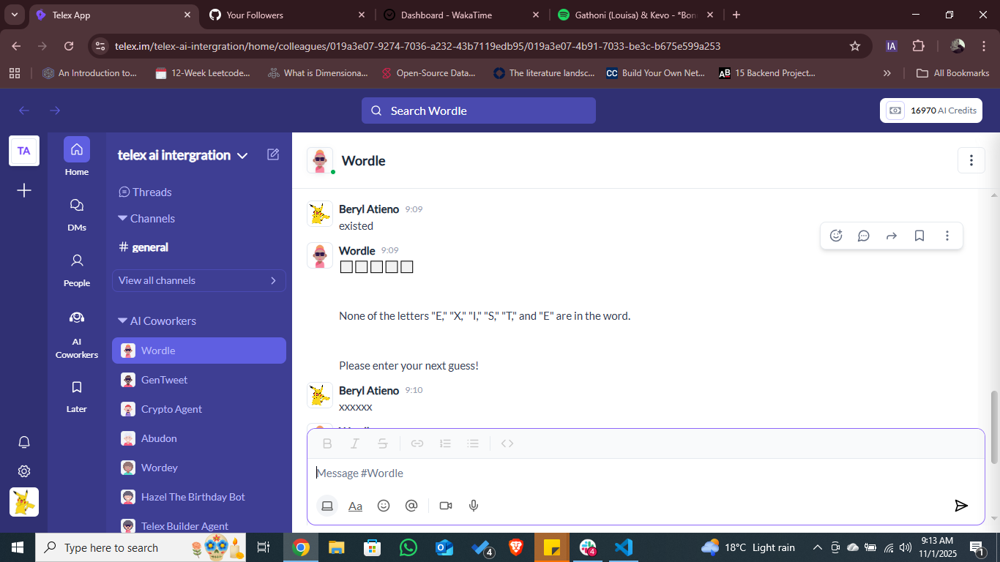
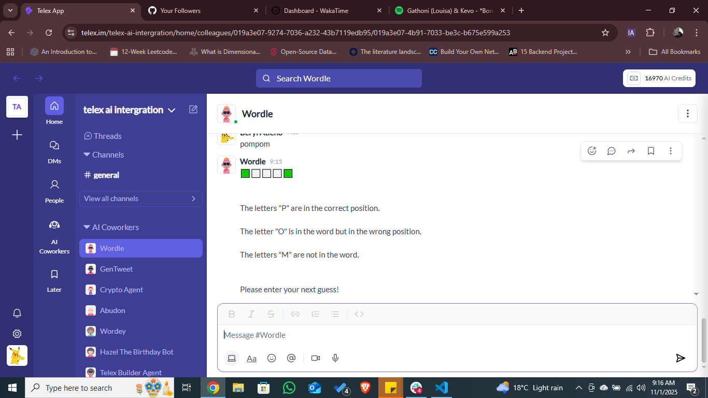

## TODO: change directory structure
- update Dockerfile to reflect the change
- delete pkg

## TODO: update the api endpoints

- add the recommended /a2a/agent 

## TODO: review the workflow trigger/ figure out why the bot is not starting game
## TODO: test
## TODO: deploy to railway
- study how updates work if not deployed from github, change to github deployment if needed

## TODO: update docs
## TODO: add docs endpoint and a link in Telex json

## TODO: test workflow in Telex
## TODO: record demo if it works

## TODO: update README.md (with demo and everything)

### more than 5 letters

### invalid English word

### Other issues
- allows more than 6 responses

### what the agent adds
- check for word validity
- error handlng for more than five-letter words
- limit a session to 6 guesses with results